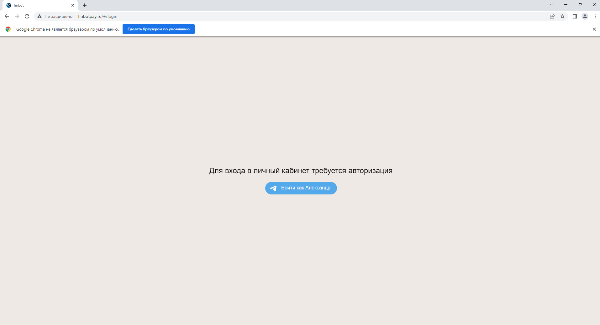
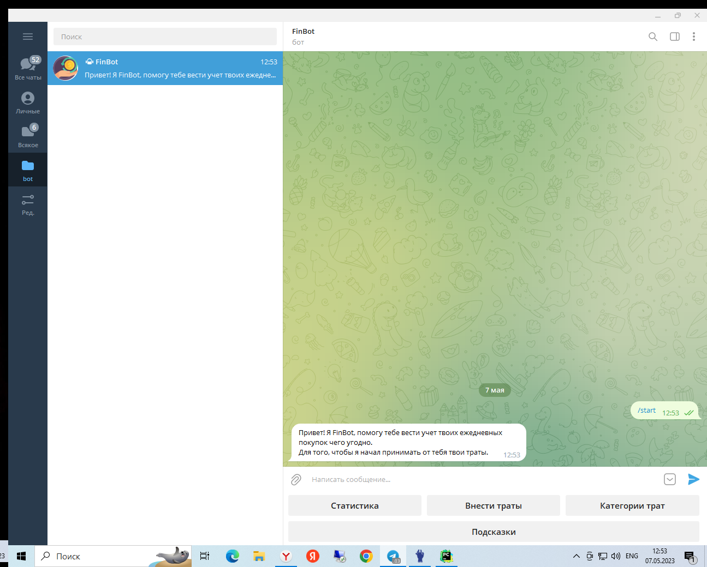
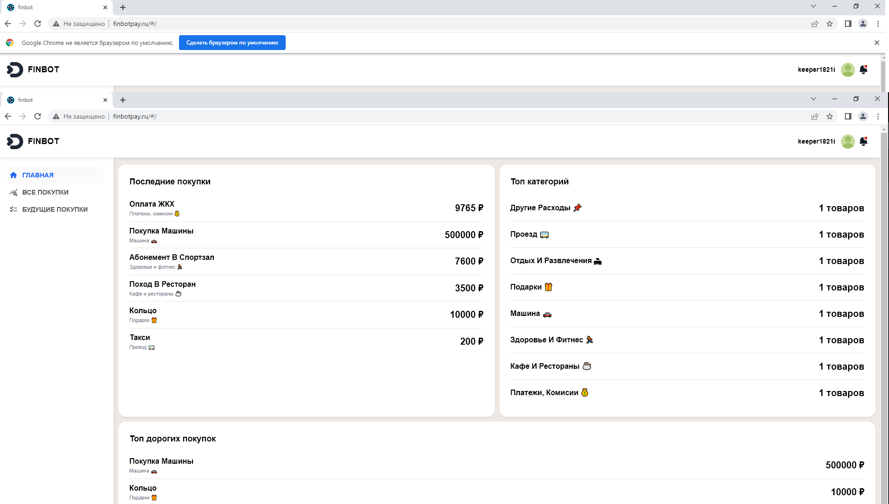

# Телеграм бот для контроля своих расходов на фреймворке Django 


Проект разработан для учета трат, вывода статистики и контроля расходов
Первичная регистрация пользователя происходит непосредственно в боте.
Также разработан личный кабинет по адресу http://finbotpay.ru, где пользователь может посмотреть более детально свои 
траты. Доступ в личный кабинет использует авторизацию через Телеграм. 

Данный проект состоит из двух основных компонентов:
### 
1. Телеграм бота, написанного с использованием библиотеки pyTelegramBotAPI. Бот реализован с помощью 
Custom Django Management Commands. https://t.me/SaveReceiptBot 

2. АПИ для предоставления данных в личный кабинет, расположенный по адресу http://finbotpay.ru реализовано с помощью 
Django REST framework. 

## Структура проекта
### Проект состит из следующих частей
1. Приложения:
 - `bot_app` - приложение с реализацией бота;
 - `expenses_app` - приложение для обработки трат, реализация API;
2. Документация:
 - `README` - файл документации;
 - `requirements` - файл зависимостей;
3. Служебные директории:
 - `static` - статичные файлы верстки сайта;
4. Системные и служебные файлы:
 - `FinBot` - директория настроек django-проекта;

Документация по каждому из приложений расположена в директории `Readme`.

## Установка проекта
Для установки исходника необходимо ввести следующую команду:
```
git clone https://github.com/keeper1821i/DjangoTelegramBot.git
```
Чтобы проект работал корректно, необходимо установить зависимости командой:
```
git install -r requirements.txt
```
Далее необходимо выполнить миграции. Сделать это можно командой:
```
python manage.py migrate
```
Следующим шагом будет создание суперпользователя для управления и доступа в админ-панель. Сделать это можно командой:
```
python manage.py createsuperuser
```
Далее необходимо указать токен бота в файле FinBot/config.py:

По умолчанию используется база данных SQLite, при необходимости можно прописать другую СУБД в FinBot/settings.py

Также проект можно развернуть с помощью Docker, для этого настроены Dockerfile и docker-compose.yml

## Запуск проекта
### Для запуска проекта без использования Docker необходимы две команды:
Для запуска непосредственно бота
```
python manage.py bot
```
Для запуска Django сервера для работы API
```
python manage.py runserver
```
